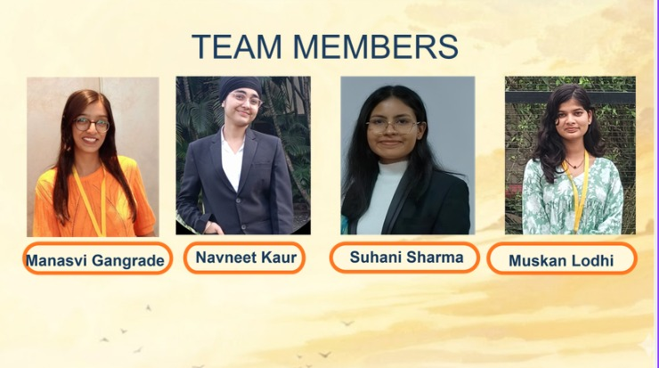
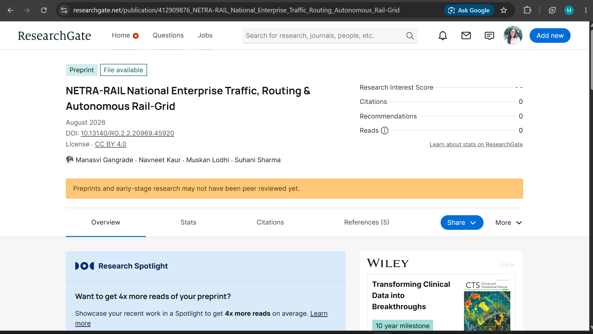

<div align="center">


### Team Roster — Indore Institute of Science and Technology (IIST), Indore

| Team Lead & AI Architecture | Backend & Agent Orchestration | Data & Spatial Analytics | Frontend & Design Systems |
| :---: | :---: | :---: | :---: |
| **Manasvi Gangrade** | **Navneet Kaur** | **Suhani Sharma** | **Muskan Lodhi** |

---

# NETRA-RAIL MOBILE
### The Human Interface Layer
**A Role-Adaptive, Multi-Stakeholder Mobile Companion to Autonomous Rail Intelligence**

---

[](https://netra-rail-mobile.vercel.app/)
[](https://github.com/Manasvi-Gangrade/NETRA-RAIL-Mobile)
[](https://drive.google.com/file/d/1oaInPgCIC4bmj1km_1ekqU2LOPCNW_pA/view?usp=sharing)
[](https://www.researchgate.net/publication/412909876_NETRA-RAIL_National_Enterprise_Traffic_Routing_Autonomous_Rail-Grid)
[](https://netra-rail-backend.onrender.com/docs)

[](https://unstop.com)
[]()
[]()
[]()

</div>

---

<div align="center">


</div>

---


<div align="center">

### Indore Institute of Science and Technology (IIST), Indore

[](https://github.com/Manasvi-Gangrade/NETRA-RAIL-Mobile)

| Team Lead & AI Architecture | Backend & Agent Orchestration | Data & Spatial Analytics | Frontend & Design Systems |
| :---: | :---: | :---: | :---: |
| **Manasvi Gangrade** | **Navneet Kaur** | **Suhani Sharma** | **Muskan Lodhi** |

</div>

---


<div align="center">

| NETRA-RAIL Live Mobile Platform | Mobile System Detailed Documentation | Team Japan Buddies Roster |
| :---: | :---: | :---: |
| [](https://netra-rail-mobile.vercel.app/) | [](https://drive.google.com/file/d/1oaInPgCIC4bmj1km_1ekqU2LOPCNW_pA/view?usp=sharing) | [](https://github.com/Manasvi-Gangrade/NETRA-RAIL-Mobile) |
| [](https://netra-rail-mobile.vercel.app/) | [](https://drive.google.com/file/d/1oaInPgCIC4bmj1km_1ekqU2LOPCNW_pA/view?usp=sharing) | [](https://github.com/Manasvi-Gangrade/NETRA-RAIL-Mobile) |

| Web Command Platform | FastAPI Interactive API Specs | Published Research Paper |
| :---: | :---: | :---: |
| [](https://netra-rail.vercel.app/) | [](https://netra-rail-backend.onrender.com/docs) | [](https://www.researchgate.net/publication/412909876_NETRA-RAIL_National_Enterprise_Traffic_Routing_Autonomous_Rail-Grid) |

| Technical System Report | System Datasets & Matrix | Presentation & Walkthrough |
| :---: | :---: | :---: |
| [](https://drive.google.com/file/d/1oaInPgCIC4bmj1km_1ekqU2LOPCNW_pA/view?usp=sharing) | [](https://github.com/Manasvi-Gangrade/NETRA-RAIL-Mobile) | [](https://drive.google.com/file/d/1NMADT7SHeiZWvHsdfXJ0bxiMMUkG7TT0/view?usp=sharing) |

</div>

---


| Category | Mobile Deliverable Resource | Direct Link |
| :--- | :--- | :--- |
| **Mobile Web App** | **Live Deployed Mobile Application** | [netra-rail-mobile.vercel.app](https://netra-rail-mobile.vercel.app/) |
| **Mobile Codebase** | **NETRA-RAIL Mobile GitHub Repository** | [GitHub: NETRA-RAIL-Mobile](https://github.com/Manasvi-Gangrade/NETRA-RAIL-Mobile) |
| **Mobile System Docs** | **NETRA-RAIL Mobile Detailed Documentation** | [Download PDF / View Drive](https://drive.google.com/file/d/1oaInPgCIC4bmj1km_1ekqU2LOPCNW_pA/view?usp=sharing) |
| **Main Web App** | **NETRA-RAIL Command Platform** | [netra-rail.vercel.app](https://netra-rail.vercel.app/) |
| **Main Codebase** | **NETRA-RAIL Core GitHub Repository** | [GitHub: NETRA-RAIL](https://github.com/Manasvi-Gangrade/NETRA-RAIL) |
| **Academic Research** | **Official Published Research Paper** | [View on ResearchGate](https://www.researchgate.net/publication/412909876_NETRA-RAIL_National_Enterprise_Traffic_Routing_Autonomous_Rail-Grid) |
| **API Documentation** | **Interactive Swagger API Specs** | [OpenAPI Docs (Port 8000)](https://netra-rail-backend.onrender.com/docs) |
| **Pitch Video** | **Team Japan Buddies Pitch Video** | [Watch Pitch Video](https://drive.google.com/file/d/1R9E-1vcXqS20iqk7A6oJL_xdBe-wFvNo/view?usp=sharing) |
| **Demonstration** | **MVP Explanation & Walkthrough Video** | [Watch MVP Video](https://drive.google.com/file/d/1NMADT7SHeiZWvHsdfXJ0bxiMMUkG7TT0/view?usp=sharing) |
| **Concept Animation** | **System Architecture Animated Video** | [Watch Animation](https://drive.google.com/file/d/1_3v_emz57zLhMmDDoCc79pb1x67Ytoec/view?usp=sharing) |

---


- [Introduction — The Human Interface Layer](#1-introduction--the-human-interface-layer)
- [Background & Motivation](#2-background--motivation)
- [Problem Statement — The Missing Fifth Layer](#3-problem-statement--the-missing-fifth-layer)
- [Proposed Solution — Role-Adaptive Architecture](#4-proposed-solution--the-role-adaptive-application-architecture)
  - [Unified Gateway & Role Detection](#41-unified-gateway--login--role-detection)
  - [Role A: Passenger (Human Sensor & Beneficiary)](#42-role-a--passenger-the-human-sensor--beneficiary)
  - [Role B: Freight & Logistics Coordinator](#43-role-b--freight--logistics-coordinator-the-supply-chain-cockpit)
  - [Role C: Station Master & Controller](#44-role-c--station-master--traffic-controller-the-precedence-co-pilot)
  - [Role D: Trackman & Maintenance Crew](#45-role-d--trackman--maintenance-crew-the-field-verification-layer)
- [The Common Foundation Layer](#5-the-common-layer--what-every-role-shares)
- [The Human Flywheel Loop](#6-the-human-flywheel--how-the-app-closes-the-loop)
- [UX & Design Philosophy](#7-ux--design-philosophy)
- [Technology Stack](#8-technology-stack)
- [Security, Privacy & Trust](#9-security-privacy--trust)
- [Impact & Real-World Applicability](#10-impact--real-world-applicability)
- [Future Roadmap](#11-future-roadmap)
- [Conclusion](#12-conclusion)

---


No autonomous system, however intelligent, can afford to operate as a black box in a domain where human lives, national infrastructure, and enormous economic value are simultaneously at stake.

The **NETRA-RAIL** core platform is a closed-loop cyber-physical brain — four interconnected pillars silently computing, rerouting, dispatching, and inspecting across Indian Railways' 68,000 route kilometres. However, every algorithmic decision made inside that flywheel eventually surfaces as a real consequence for a real human being:
- A passenger on a platform wondering why their train has slowed down.
- A freight coordinator staring at a demurrage bill.
- A station master deciding whether to trust an AI precedence override during peak-hour congestion.
- A trackman receiving a maintenance alert on a rain-soaked night shift.

**NETRA-RAIL MOBILE** is the human interface layer of the same autonomous organism. A single, role-adaptive mobile application that transforms every stakeholder from a passive bystander into an active participant in the autonomous flywheel.

> **Where the Web Command Center is built for control rooms, NETRA-RAIL MOBILE is built for pockets, platforms, cabins, and track-side construction sites.**

---


Today, every layer of Indian Railways' workforce and ridership interacts with the system through fragmented, analogue, or low-fidelity channels:

| Stakeholder Layer | Current Operational Bottleneck | NETRA-RAIL Mobile Solution |
| :--- | :--- | :--- |
| **Passengers** | Delayed discovery of train holds via crackling platform announcements or generic apps | Live delay-cause explanation (e.g. "Slowed for drone inspection @ KM 134") |
| **Freight Coordinators** | Manual tracking via phone calls, WhatsApp, and email spreadsheets | Real-time vessel ETA feed, demurrage-risk meter, and one-tap AI override |
| **Station Masters** | Precedence overrides executed on instinct and radio chatter | Live explainable JSSP precedence feed with instant human override control |
| **Trackmen Crew** | Verbal orders or paper slips with no verified defect reports | Verified work orders with drone CV imagery, GPS coordinates, and one-tap resolution |

---


While the core NETRA-RAIL platform addresses four formal Smart India Hackathon problem statements (SIH25209, SIH25022, SIH25177, SIH25021), a fifth unstated problem undermines real-world deployment:

```
+-----------------------------------------------------------------------------------+
| PROBLEM 5: ABSENCE OF A UNIFIED ROLE-AWARE HUMAN-IN-THE-LOOP INTERFACE             |
+-----------------------------------------------------------------------------------+
| Autonomous decision engines governing freight logistics, traffic precedence, and  |
| infrastructure safety currently operate with no direct, real-time, role-adaptive   |
| communication channel to the human stakeholders who must trust or act upon them.  |
| This absence creates adoption resistance, delayed human responses to safety       |
| alerts, and a persistent trust deficit.                                           |
+-----------------------------------------------------------------------------------+
```

**NETRA-RAIL MOBILE** exists to solve this exact fifth problem — turning four backend AI pillars into a visible, trusted, and actively co-piloted experience.

---


NETRA-RAIL MOBILE is architected as a **single application binary** with a unified authentication gateway. At login, the app dynamically detects the user's role and reshapes its navigation, permission matrix, and visual interface around that stakeholder.

### 4.1 Unified Gateway & Role Detection
- **Passengers:** Authenticate via mobile OTP or DigiLocker — instant, frictionless access.
- **Freight Coordinators:** Authenticate via port/plant organisation employee ID.
- **Station Masters & Controllers:** Authenticate via Indian Railways staff credentials with Zonal Role-Based Access Control (RBAC).
- **Trackmen & Field Crew:** Authenticate via a low-literacy-friendly PIN or biometric flow optimized for gloved, trackside use.

---

-10B981?style=for-the-badge)

Transforms every passenger into both a beneficiary of real-time operational transparency and a literal sensor node powering Pillar C's crowdsourced track monitoring.

```
[Journey Detection] --> [Toggle: "Contribute to Track Safety"]
                                  |
               [Passive 3-Axis IMU Background Stream]
                                  |
              [Live Transparent Delay Reason & ETA Feed]
                                  |
                     [Track Guardian Score Tally]
```

- **Background Sensing Toggle:** One-tap opt-in to stream anonymised 3-axis accelerometer and gyroscope data to Pillar C's AKNN vector engine.
- **Transparent Delay Explanations:** "Train slowed near KM 134 due to active track verification. Drone inspection ETA: 12 minutes."
- **Track Guardian Score:** Gamified running tally of kilometres monitored and track anomalies indirectly detected.
- **Multilingual Assistant:** Natural language voice/text query engine ("Mera train kahan hai?", "Delay kyun hai?") answered in regional dialects.

---


Serves as a pocket supply-chain cockpit for Pillar A's intermodal freight synchronisation engine.

- **Vessel ETA Feed:** Real-time shipping port manifests linked downstream to wagon dispatch queue previews.
- **Demurrage-Risk Meter:** Colour-coded live financial risk tracking per port/plant.
- **One-Tap AI Override:** Approve or override AI-recommended dispatch queues with mandatory rationale logging for institutional learning.

---


Acts as an explainable precedence co-pilot for Pillar B's real-time JSSP section throughput optimizer.

- **Explainable Precedence Feed:** Live visual queue of which freight trains are held at loop lines and for how long.
- **Slow-Zone Visibility:** Instant notification when Pillar C/D trigger speed restrictions, paired with live drone flight ETAs.
- **Instant Manual Override:** Single large control allowing controllers to take back manual authority in seconds.

---


Engineered specifically for field conditions — bright sunlight, gloved operation, rain, and low connectivity.

- **Verified Work Orders:** Pushed directly from Pillar D's Garun CV engine with drone-captured imagery, GPS coordinates, and defect classification.
- **Offline-First Storage:** Local caching of maps and work orders for zero-connectivity track segments.
- **One-Tap "Mark Resolved":** Field verification that immediately signals Pillar B to lift the corresponding slow-zone speed restriction.

---


- **230+ Languages & Voice AI:** Powered by **IndicTrans2** and BCP-47 TTS locale mapping across every screen and role.
- **Live Flywheel Pulse Widget:** A compact, always-visible status indicator showing the connected 4-pillar health.
- **Offline-First Sync:** WatermelonDB local caching for uninterrupted field performance.
- **Privacy & Consent Center:** Transparent settings allowing users to pause or delete contributed telemetry at any time.

---


```
[Passenger App] Opts in to Track Safety -> IMU telemetry streams to Pillar C
       |
       v
[Pillar C] Anomaly cluster isolated at GPS coordinate -> Geo-tagged flag generated
       |
       v
[Controller App] Station Master sees live slow-zone enforcement the instant it fires
       |
       v
[Trackman App] Verified work order with drone imagery pushed to nearest crew
       |
       v
Crew resolves defect on-site -> Taps "Mark Resolved"
       |
       v
[Pillar B] Slow-zone automatically lifted -> Section throughput restored
       |
       v
[Passenger App] Journey ETA silently recalculates and updates in real time
```

> **No phone calls. No paper slips. Zero opacity. The loop begins with a commuter's smartphone and ends with that same commuter seeing their ETA correct itself.**

---


| Component | Technology / Library |
| :--- | :--- |
| **Cross-Platform Framework** | React Native (Expo) — Single codebase for iOS & Android |
| **Local Offline Database** | WatermelonDB & Redux Toolkit (Offline-First local storage) |
| **Real-Time Messaging** | Firebase Cloud Messaging & WebSockets via FastAPI Backend |
| **Background Telemetry** | React Native Sensors API (3-Axis Accelerometer & Gyroscope) |
| **Authentication & RBAC** | Firebase Auth, OTP / DigiLocker, Railway SSO |
| **Geospatial & Mapping** | Mapbox Mobile SDK with offline map-tile caching |
| **Multilingual NLP & Voice** | IndicTrans2, Speech-to-Text / Text-to-Speech Engine |
| **Backend AI Bridge** | Shared FastAPI Services with NETRA-RAIL Core Engine |

---


- **Anonymised Telemetry:** Passenger IMU sensor data is scrubbed of device identifiers before vector ingestion.
- **Strict Opt-In:** Background sensing is 100% voluntary, pausable, and deletable.
- **Immutable Audit Trail:** Staff overrides and work order resolutions require mandatory rationale logging.
- **Strict Role Isolation:** RBAC ensures passenger accounts cannot view staff or operational control data.

---


- **Phase 1 (Current MVP):** Interactive passenger role with simulated IMU contribution, live flywheel pulse widget, and unified 4-role login gateway.
- **Phase 2 (Delhi Round):** Live push notifications connected to core Pillar B/C/D events; offline-first trackman sync verified in low-signal zones.
- **Phase 3 (Japan Finale):** Production rollout across a pilot zonal railway with real employee SSO and live coordinator override authority.

---


An autonomous system is only as strong as the trust humans place in it. NETRA-RAIL's four pillars solve the hardest computational problems in rail logistics and traffic — but computation alone does not move a controller to accept an AI override or reassure a passenger during a delay.

**NETRA-RAIL MOBILE is the layer that earns that trust.** One application binary. Four dynamic roles. One transparent window into the future of Indian Railways.

---

<div align="center">


[](https://github.com/Manasvi-Gangrade/NETRA-RAIL-Mobile)

*Developed by Team Japan Buddies for Indian Railways*

</div>
